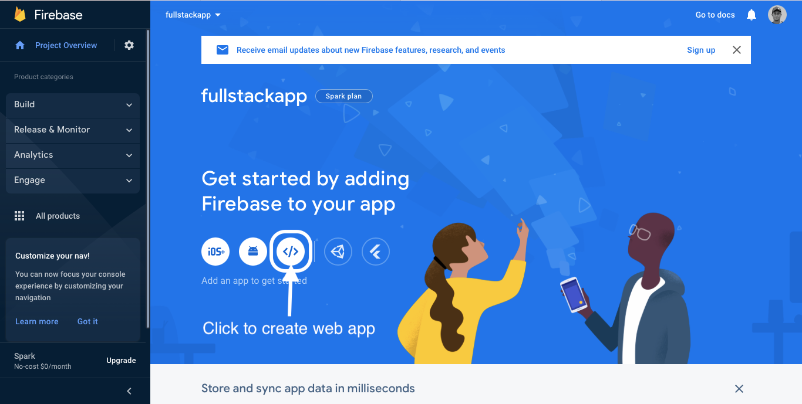
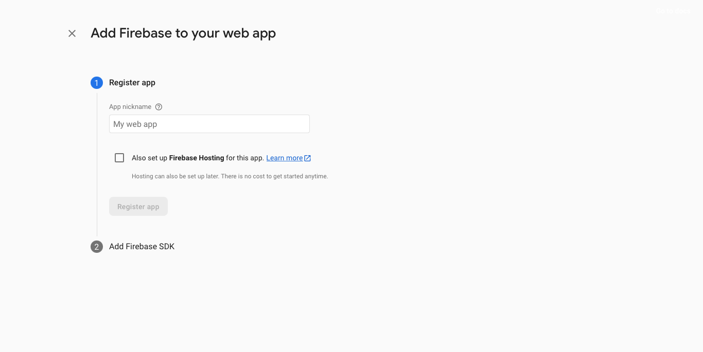
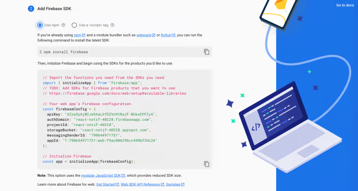

How to Set Up a Next.js 13 Project

Step 1:
In your desired directory, launch your terminal and run the following
npx create-next-app

Step 2:
Enter your project name and click enter and wait for it to install.

Step 3:
A new directory with your project name will be created with the necessary files.

Step 4:
cd your way into the new directory:
cd <project-name>

Step 5:
To start the development server, run the following command:

// if you're using yarn
yarn dev

// if you're using npm
npm dev

Step 6:
Running that command will start the developement server and you can see your Next.js 13 app running on http://localhost:3000.

How to Set Up Firebase in Next.js

Step 1:
Go to https://console.firebase.google.com/ and login in with your Google account.

Step 2:
Click on Add Project and give your project a name. Click on Continue.

Step 3:
On the next screen you can choose if you want to enable analytics for your project.

Step 4:
Click on Create project.

Step 5:
Next, you need to create a web app. On your project homepage click on the web icon to create your web app

Step 6:
Give your web app a name and click Register app.

Step 7:
Copy the configuration file we are going to need it later. Click next until you are done.
This is what the final generated config should look like

Add this config into your firebase-messaging-sw.js and firebase.ts file

Step 8:
Next, we need to generate a web push certificate key. Navigate to the cloud messaging tab for your project and scroll to the Web configuration section.

Under Web Push certificates, click on Generate key pair. Note the key that gets generated.

Back in the firebase.ts file, we now need to enable messaging. Add Generated key into vapidKey
